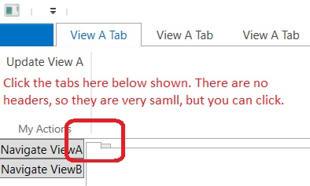

# Basic example of Tab Control. 
- This builds from the previous example. 
- This is just another flavor of the previous example, it does not introduce any new concepts.
- In the shell window view, change the content control to tab control as follows.

```cs
<TabControl prism:RegionManager.RegionName="ContentRegion" Margin="1,3,3,3" />
```
- Also add more attributes to the ViewA as follows.

```cs
[RibbonTab(typeof(ViewATab))]
[RibbonTab(typeof(ViewATab))]
[RibbonTab(typeof(ViewATab))]
public partial class ViewA : UserControl
{
    public ViewA()
    {
        InitializeComponent();
    }
}
```

- Now run the app.

- 

